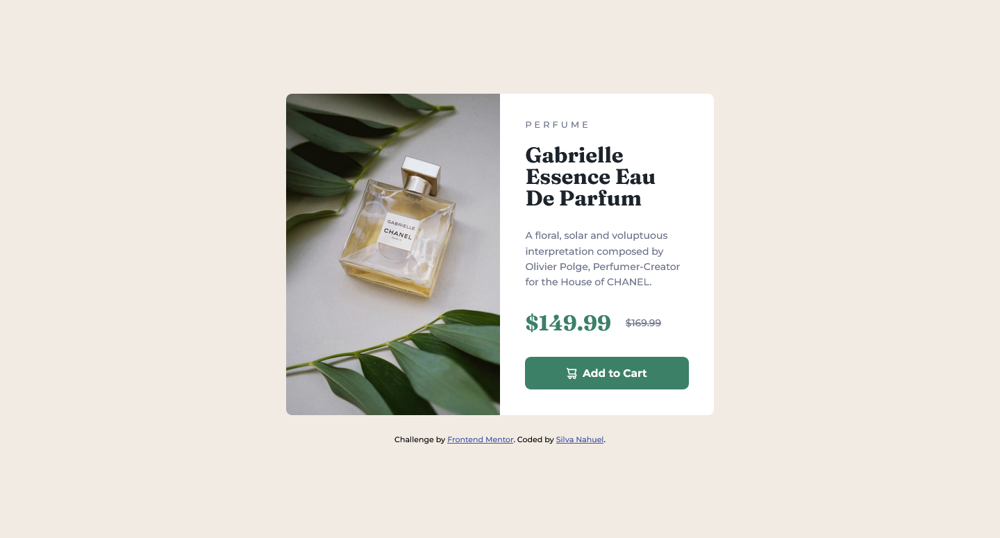
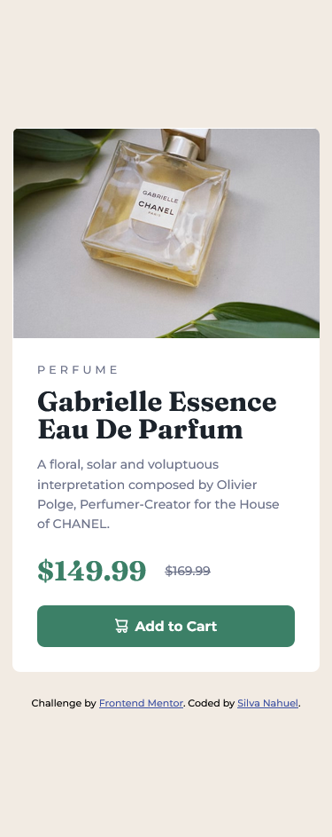

# Frontend Mentor - Product preview card component solution

This is a solution to the [Product preview card component challenge on Frontend Mentor](https://www.frontendmentor.io/challenges/product-preview-card-component-GO7UmttRfa). Frontend Mentor challenges help you improve your coding skills by building realistic projects. 

## Table of contents

- [Overview](#overview)
  - [The challenge](#the-challenge)
  - [Screenshot](#screenshot)
  - [Links](#links)
- [My process](#my-process)
  - [Built with](#built-with)
  - [What I learned](#what-i-learned)
- [Author](#author)

## Overview

### The challenge

Users should be able to:

- View the optimal layout depending on their device's screen size
- See hover and focus states for interactive elements

### Screenshot




### Links

- Solution URL: [Solution](https://www.frontendmentor.io/challenges/product-preview-card-component-GO7UmttRfa/hub
- Live Site URL: [Github page](https://klonaush.github.io/product-preview-card-component/)

## My process

### Built with

- Semantic HTML5 markup
- CSS custom properties
- Flexbox

### What I learned

It helped me to improve my practices in the use of positions and opacities.

```css
.main-image .mobile {
        position: relative;
        width: 100%;
        max-height: 16.9rem;
        opacity: 1;
    }
```

## Author

- Frontend Mentor - [@klonaush](https://www.frontendmentor.io/profile/klonaush)
- Twitter - [@klonaush](https://www.twitter.com/klonaush)
